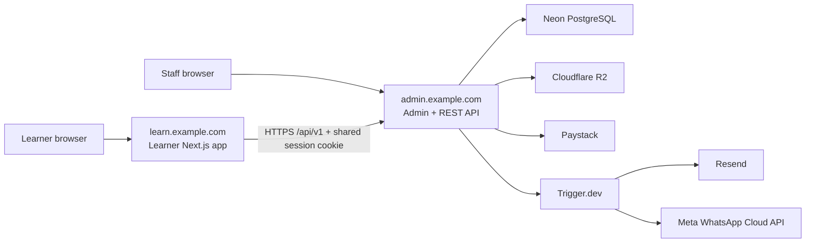

# Phase 1 LMS Architecture

Status: approved for implementation

## System boundary

The learner application is an API client. The backend/admin application is the
only database, identity, authorization, payment, publishing, review, cohort,
notification, and certificate authority.

## Deployments

- Both applications use Next.js 16, React 19, TypeScript, Tailwind CSS 4, and a
  Node.js runtime of at least 20.9.
- Vercel is the initial host. Each repository also ships a Dockerfile and uses
  portable Node, PostgreSQL, S3-compatible, and HTTP interfaces.
- Production applications share a parent domain. The API allows credentials
  only from the configured learner origin.
- All persistent timestamps are UTC. Display uses the user's or cohort's IANA
  timezone.

## Domain topology

Content is `Track -> Course -> Module -> Lesson -> LessonVersion`. Published
lesson versions are immutable and contain a versioned, validated JSON document.
Phase 1 sells permanent full-track self-paced and managed-cohort offerings.

Learner progress, payment entitlements, cohort membership, and staff roles are
separate concepts. Removing a cohort membership does not remove track ownership.
A refund or confirmed chargeback removes only its payment-derived entitlement.

## Delivery order

1. Repository collaboration and contract foundation.
2. Platform upgrades, identity, RBAC, Prisma, and OpenAPI.
3. Frontend backend-extraction and generated client integration.
4. Catalogue, payments, entitlements, and learner dashboard.
5. Page builder, curriculum import, publication, and lesson delivery.
6. Progression, assessment, submissions, reviews, and eligibility.
7. Managed cohorts, attendance, deadlines, and notifications.
8. Certificate approval, generation, and public verification.
9. Portability, recovery, accessibility, security, and beta validation.

Phase 1 is not exposed as an external beta until the release checklist passes.

