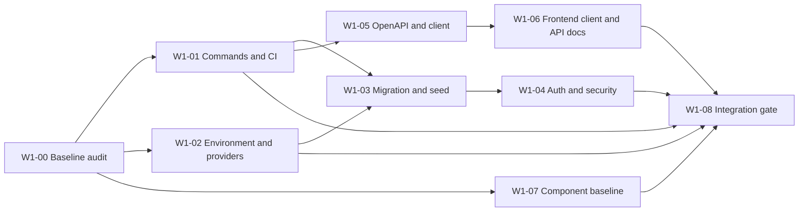

# Week 1 Day 1: Technical Baseline and Assigned Work

**Date:** August 17, 2026

**Owner:** Travis (Lead)

**Required reviewer:** Mr. Miracle

**Overall status:** Red — implementation may begin, but the Week 1 integration gate is blocked.

This document is the single source for the Day 1 assigned board, dependency map, technical audit, environment boundaries, component inventory, and acceptance gate.

## Assigned board

**Board:** Phase 1 / Week 1 Foundation

**Working branch:** `phase1/foundation` in both repositories

**Rule:** The implementer cannot approve their own pull request.

| ID | Work item | Implementer | Reviewer | Depends on | State | End-of-item deliverable |
| --- | --- | --- | --- | --- | --- | --- |
| W1-00 | Audit architecture, build, Prisma, OpenAPI, auth, CI, providers, environment boundaries, and components | Travis | Mr. Miracle | None | Done | This Day 1 evidence set |
| W1-01 | Stabilize lint, typecheck, test, and production build commands; add CI in both repositories | Travis: backend; Mr. Miracle: frontend | Cross-review | W1-00 | Ready | Required CI checks complete from clean installs |
| W1-02 | Add typed environment validation and provider readiness checks | Travis | Mr. Miracle | W1-00 | Ready | Safe environment matrix and credential smoke report |
| W1-03 | Review Prisma schema; create initial migration and idempotent permission/owner seed | Travis | Mr. Miracle | W1-01, W1-02 | Blocked | Reviewed SQL, clean apply, and two successful seed runs |
| W1-04 | Harden authentication, sessions, CSRF/origin controls, rate limits, and effective permissions | Travis | Mr. Miracle | W1-03 | Blocked | Positive and negative auth/security tests |
| W1-05 | Reconcile `/api/v1` implementation and OpenAPI; produce the versioned generated client | Travis | Mr. Miracle | W1-01 | Ready | Warning-free contract, implementation check, and client artifact |
| W1-06 | Pin the generated client, remove handwritten duplicates, and add non-production `/docs/api` | Mr. Miracle | Travis | W1-05 | Blocked | Consumer integration and production `404` evidence |
| W1-07 | Upgrade the core learner/admin component baseline | Mr. Miracle | Travis | W1-00, W1-01 | Ready | Reviewed primitives and accessibility evidence |
| W1-08 | Run cross-origin preview integration and Week 1 gate review | Travis and Mr. Miracle | Joint review; Travis approves | W1-02 through W1-07 | Blocked | Two green previews and signed gate record |

## Recommended board fields

Use `Repository`, `Area`, `Implementer`, `Reviewer`, `Priority`, `Dependency`, `State`, `Evidence`, and `Gate`. Create one cross-repository issue per row and add frontend, backend, contract, migration, test, and acceptance checklists where applicable.

## Today’s assignment outcome

- Travis owns the technical spine: CI contract, environment validation, Prisma, auth/security, OpenAPI, providers, and the integration gate.
- Mr. Miracle owns frontend CI, API consumer integration, API documentation UI, component modernization, responsiveness, accessibility, and browser evidence.
- Every work item has cross-review. Architecture, schema, authentication, OpenAPI, provider, payment, RBAC, and release decisions require Travis’s approval.
- Remote GitHub Project creation is pending because no authenticated GitHub CLI or connector is available in this workspace.

## Dependency map

The critical path is environment readiness → database baseline → authentication hardening → integration gate. Contract/client work can proceed in parallel after command and CI stabilization.

### Boundary rules

| Boundary | Learner frontend | Backend/admin |
| --- | --- | --- |
| Database | No Prisma or database credentials | Sole Prisma and migration authority |
| Identity | Auth UI and cached session presentation | Auth.js, credentials, sessions, revocation, RBAC |
| Contract | Exact generated-client version | OpenAPI source and client publication |
| Payments | Starts API checkout and displays status | Paystack references, verification, webhooks, entitlements |
| Content/progress | Renders API data and submits commands | Authoritative content, progress, assessments, certificates |
| Secrets | Public configuration only; server token only where strictly required | All provider, auth, database, and signing secrets |
| API docs | Non-production renderer | Authoritative contract source |

### Environment progression

`local → pull-request preview → integration/staging → production`

- Local uses isolated developer credentials and a disposable database branch.
- Preview uses per-environment URLs, exact-origin CORS, non-production API docs, and no production webhooks.
- Integration/staging is the only environment for end-to-end provider and webhook rehearsal.
- Production secrets never enter preview, source control, build logs, client bundles, or documentation.
- Migrations are generated and reviewed locally, tested on a disposable database, then promoted; they are never generated during deployment.

## Technical baseline report

The documented two-repository boundary is sound: `next-shadcn-frontend` is the learner client and `next-shadcn-admin` is the backend, Prisma, identity, and staff authority. Both worktrees were clean and synchronized on `phase1/foundation` when audited. The current executable baseline does not yet prove that boundary in CI or tests.

| Area | Evidence | Status | Required action |
| --- | --- | --- | --- |
| Architecture | Approved Phase 1 architecture, ADRs, data ownership, auth model, and release checklist exist | Amber | Add operational runbooks and reconcile documentation with implemented auth behavior |
| Backend build | Typecheck passes after deleting malformed generated `.next` state; production build did not return within 244 seconds | Red | Make a clean build deterministic and terminating |
| Frontend build | Typecheck passes; build produced a `BUILD_ID` but did not return within 244 seconds | Red | Remove or isolate the process keeping the build alive |
| Prisma | Prisma 7.9.1 schema validates and contains 58 models | Amber | Create/review the initial migration; add a clean database and idempotent seed test |
| OpenAPI | Contract lints with 0 errors and 14 warnings; generated types exist | Amber | Remove warnings, reconcile contract-only routes, package and publish the client |
| Authentication | Database sessions and secure cookie settings exist | Red | Close rate-limit, reset, permission, CSRF/origin, and route-boundary gaps |
| CI | No workflow exists in either repository | Red | Add required install/lint/typecheck/build/test/contract/schema checks |
| Providers | Paystack and Resend code is partial; R2, Trigger.dev, and Meta are not implemented | Red | Validate adapters, secrets, callbacks, webhooks, and safe smoke tests |
| Automated tests | No `test` or `spec` files found in either repository | Red | Establish unit, contract, integration, and browser test layers |

### Command baseline

| Repository | Check | Result |
| --- | --- | --- |
| Frontend | `tsc --noEmit` | Pass |
| Frontend | `eslint .` | Fail: ESLint 9 cannot load the legacy configuration |
| Frontend | `next build --webpack` | Fail gate: artifact generated, command did not terminate before timeout |
| Backend | `tsc --noEmit` | Pass after removing stale generated `.next` data |
| Backend | `eslint src prisma --ignore-pattern src/generated` | Fail: FlatCompat/circular configuration error |
| Backend | `prisma validate` | Pass outside the restricted sandbox |
| Backend | `redocly lint docs/openapi/lms-v1.yaml` | Pass with 14 warnings |
| Backend | `next build --webpack` | Fail gate: command did not terminate before timeout |

Both repositories require Node `>=20.9.0`, but the audited machine runs Node `24.19.0`. CI must pin the agreed LTS runtime so local success is reproducible.

### Contract and route drift

Implemented `/api/v1` areas are health, authentication registration/verification/password login/logout/session, catalogue tracks, checkout sessions, and the Paystack webhook. The OpenAPI contract also declares dashboard, lessons/progress, quiz attempts, submissions, cohort check-in, and certificate verification routes that are not implemented yet. These must be labelled as planned or omitted from the released contract until implemented.

The 14 OpenAPI warnings cover incomplete API metadata, development/example server values, missing tag descriptions, and missing `4XX` responses on four operations. The frontend currently uses handwritten API types rather than a published, exact-version client package.

### Authentication and security drift

- The proxy enforces an exact origin only when an `Origin` header is present; unsafe requests without it are currently accepted.
- CORS advertises `X-CSRF-Token`, but a CSRF token is not validated.
- Registration and password login have no application rate limiting.
- Password reset endpoints and flows are absent.
- The session endpoint returns an empty permission list instead of effective scoped permissions.
- Google Auth.js routes are under `/api/auth`, while the architecture expects the learner-facing auth boundary under `/api/v1/auth/*`.

These are implementation gaps, not reasons to move identity into the frontend.

### Environment and provider baseline

| Concern | Frontend | Backend/admin |
| --- | --- | --- |
| Local env file | Present | Absent |
| Public variables | App URL and API URL are set | None should be client-exposed by default |
| Server-only variables | OAuth token is present; must remain server-only | All documented variables are currently missing locally |
| Database | Forbidden | `DATABASE_URL` and `DIRECT_URL` required |
| Auth | No auth secret | Auth secret, Google credentials, cookie domain, owner email, learner origin |
| Storage | API consumer only | R2 endpoint, bucket, key, secret, and public/base URL |
| Payments | API consumer only | Paystack secret and webhook secret |
| Messaging/jobs | Presentation only | Resend, Meta, email-from, and Trigger.dev secrets |

Secret values were not read into this report. No live provider connectivity was claimed because backend credentials are unavailable.

### Provider readiness

| Provider | Current implementation | Readiness |
| --- | --- | --- |
| Neon/PostgreSQL | Prisma adapter/schema present; no local connection or migration history | Blocked |
| Paystack | Initialization/verification client and webhook route present | Partial; needs live sandbox verification and negative/idempotency tests |
| Resend | Direct email helper present | Partial; needs adapter boundary, configuration validation, and delivery records |
| Cloudflare R2 | Dependencies/env contract only | Not implemented |
| Trigger.dev | Environment placeholder only | Not implemented |
| Meta WhatsApp | Environment placeholders only | Not implemented |
| Vercel | Intended target; no audited CI/deployment evidence | Unverified |

### Priority blockers

1. **P0:** Fix lint configuration and non-terminating builds, then encode the commands in CI.
2. **P0:** Establish the backend environment contract and disposable Neon database before creating migration history.
3. **P0:** Harden browser-write origin/CSRF behavior and authentication before shared-domain testing.
4. **P1:** Reconcile the released OpenAPI surface and publish an exact generated client.
5. **P1:** Add test layers; current quality claims are not regression-protected.
6. **P1:** Implement provider adapters and safe readiness checks without placing secrets in client code or logs.

## Component inventory

### Snapshot

| Repository | UI primitives | All component files | Route/page files | Automated component tests |
| --- | ---: | ---: | ---: | ---: |
| Learner frontend | 43 | 103 | 17 | 0 |
| Backend/admin | 32 | 61 | 33 | 0 |

Registry entries make components available for selective import; they do not make imported code automatically production-ready. `@animate-ui` is important for deliberate interaction and feedback, but animation must preserve reduced-motion behavior and must not hide state changes.

### Learner frontend

| Decision | Components/areas | Reason |
| --- | --- | --- |
| Keep and test | Core content/docs rendering, layout shell, navigation, forms, shared loading/error patterns | Directly supports marketing, API docs, auth, and learning surfaces |
| Update in Week 1 | Button, input, form, dialog/sheet, navigation menu, table, toast/sonner, skeleton, progress, tabs/accordion | Establish tokens, focus states, keyboard behavior, error states, and consistent APIs |
| Replace as domains land | Static pricing/billing presentation and handwritten API types | Must consume Paystack-backed backend offerings and generated contract types |
| Remove or isolate | Starter charts, project switcher, obsolete SaaS demo content | Not part of the learner Phase 1 experience unless an accepted feature requires it |

The learner UI library currently contains accordion, alerts, avatar, badge, button, calendar, card/chart, checkbox, command, dialogs, menus, form controls, navigation, overlays, progress, selection controls, table, tabs, toast, toggles, tooltip, and related primitives.

### Backend/admin

| Decision | Components/areas | Reason |
| --- | --- | --- |
| Keep and test | Admin shell/sidebar, data table foundation, layouts, headers, forms, dialogs, tables, toasts | Useful for content, review, cohort, payment, and operations workflows |
| Update in Week 1 | Button, input/form, alert dialog, dropdown, select, table, tabs, toast, sidebar, loading/empty/error states | Establish destructive-action safety, dense-data accessibility, and consistent validation |
| Replace as domains land | Template dashboards and placeholder settings actions | Must be driven by real API permissions and domain data |
| Remove or isolate | Demo chats/tasks, fake mutations, unsupported settings | False affordances are unsafe in an authoritative staff application |

The admin UI library contains alerts, avatar, badge, button, calendar, card, checkbox, collapsible/command, dialogs, menus, forms, layout containers, popover, radio/select/switch, sidebar/sheet, table, tabs, text area, toast, and tooltip primitives.

### Component rules

1. Feature code imports local approved primitives; it does not import registry internals directly.
2. Each primitive has one owner repository. Do not create a shared package during Week 1 unless duplicated fixes prove it necessary.
3. Variants use typed APIs and shared tokens; no page-specific forks for color, spacing, or focus behavior.
4. Every interactive primitive must support keyboard navigation, visible focus, disabled/loading/error states, and reduced motion.
5. Destructive admin actions require explicit confirmation, server authorization, and an auditable result.
6. Add focused tests for behavior and accessibility; snapshots alone are insufficient.
7. Import only the registry component needed for an accepted issue and review its source before merging.

Mr. Miracle prepares the frontend/admin primitive updates and browser evidence. Travis reviews contract boundaries, permission-sensitive states, destructive actions, and API error handling. Both approve the final keep/update/replace/remove decisions before the design-system baseline is marked complete.

## Week 1 acceptance gate

**Gate ID:** `W1-GATE`

**Gate owner:** Travis

**Required reviewer:** Mr. Miracle

**Current state:** Defined; blocked; joint sign-off pending

Week 2 domain work may begin only after every required criterion is evidenced or an explicit, time-bounded exception is approved by Travis and recorded in an ADR or issue.

### Required criteria

- [ ] Clean installs of both repositories pass lint, typecheck, tests, and production build on the pinned CI Node version, with no timeout or orphan process.
- [ ] Required CI workflows run on pull requests and `main`; branch protection requires their success and one cross-review.
- [ ] Prisma validation passes; reviewed initial migration applies to an empty disposable database; the permission/owner seed succeeds twice without duplicates.
- [ ] Registration, verification, password login, Google login, session expiry/revocation, logout, and reset flows have positive and negative tests.
- [ ] Browser writes enforce exact allowed origin plus an explicit CSRF strategy; login/reset endpoints have rate limits; effective permissions are returned and enforced server-side.
- [ ] OpenAPI has zero errors and zero warnings, describes only released behavior, and is checked against backend implementation.
- [ ] A versioned TypeScript client is generated and published; the frontend pins its exact version and removes equivalent handwritten contract types.
- [ ] `/docs/api` works in non-production and returns `404` in production unless an explicit safe override is enabled.
- [ ] Environment validation separates public and server-only values and fails early without printing secrets.
- [ ] Neon, R2, Paystack, Resend, Meta, Trigger.dev, and Vercel readiness is recorded as pass, intentionally deferred, or blocked with an owner and due date.
- [ ] Core learner/admin primitives pass keyboard, focus, responsive, loading, empty, error, disabled, and reduced-motion review.
- [ ] Both applications deploy independently to preview and shared authentication passes in a real browser across the configured origins.
- [ ] Architecture, schema, authentication, OpenAPI, provider, RBAC, and security-sensitive diffs receive Travis approval and Mr. Miracle cross-review.

### Evidence record

| Evidence | Result |
| --- | --- |
| Backend CI | Blocked |
| Frontend CI | Blocked |
| Migration and seed | Blocked |
| Auth/security tests | Blocked |
| OpenAPI/client | Blocked |
| Production docs exclusion | Blocked |
| Provider readiness | Partial; see Provider readiness above |
| Component review | Baseline complete; see Component inventory above |
| Preview/browser review | Blocked |

### Sign-off

- [*] Travis — technical acceptance and final Week 1 approval
- [ ] Mr. Miracle — cross-repository review and experience acceptance

The criteria above are the agreed working gate derived from the approved Week 1 plan. The unchecked signatures deliberately prevent the documentation from claiming that the implementation itself has passed.
